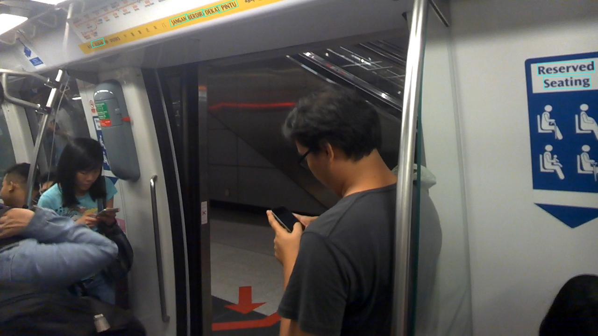
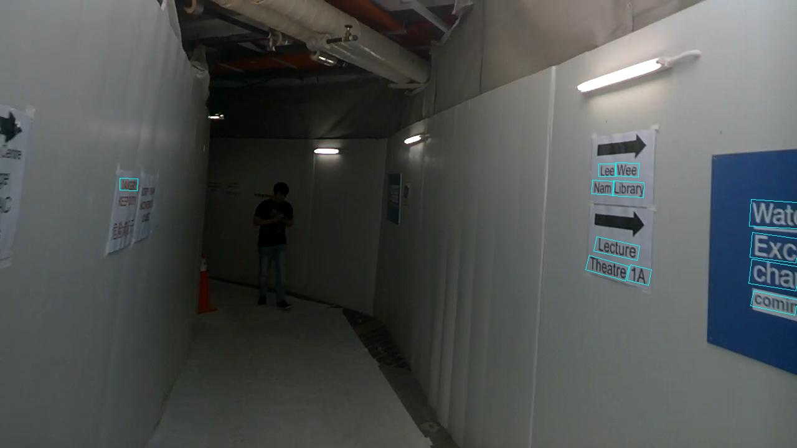
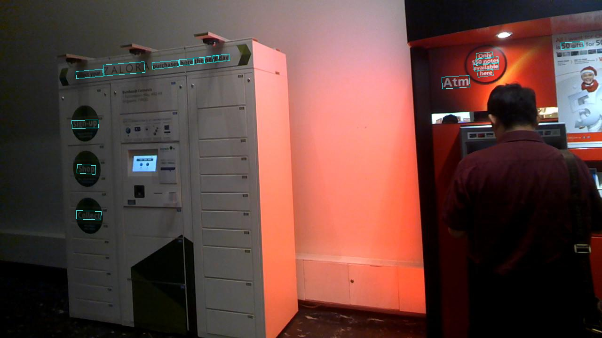

# EAST: An Efficient and Accurate Scene Text Detector

This is a Keras implementation of EAST based on a Tensorflow implementation made by [argman](https://github.com/argman/EAST).

The original paper by Zhou et al. is available on [arxiv](https://arxiv.org/abs/1704.03155).

+ Only RBOX geometry is implemented
+ Differences from the original paper
    + Uses ResNet-50 instead of PVANet
    + Uses dice loss function instead of balanced binary cross-entropy
    + Uses AdamW optimizer instead of the original Adam

The implementation of AdamW optimizer is borrowed from [this repository](https://github.com/shaoanlu/AdamW-and-SGDW).

The code should run under both Python 2 and Python 3.

### Requirements

Keras 2.0 or higher, and TensorFlow 1.0 or higher should be enough.

I will add a list of packages and their versions under which no errors should occur later.

### Data

You can use your own data, but the annotation files need to conform the ICDAR 2015 format.

ICDAR 2015 dataset can be downloaded from this [site](http://rrc.cvc.uab.es/?ch=4&com=introduction). You need the data from Task 4.1 Text Localization.\
You can also download the [MLT dataset](http://rrc.cvc.uab.es/?ch=8&com=introduction), which uses the same annotation style as ICDAR 2015, there.

Alternatively, you can download a training dataset consisting of all training images from ICDAR 2015 and ICDAR 2013 datasets with annotation files in ICDAR 2015 format [here](https://drive.google.com/a/nlab-mpg.jp/uc?id=1p9a3K0czxIJ6zx0cFMURnKg5ydTK3jlk&export=download).\
You can also get a subset of validation images from the MLT 2017 dataset containing only images with text in the Latin alphabet for validation [here](https://drive.google.com/a/nlab-mpg.jp/uc?id=1Ljye_kHCfZ54wHQINOivgClUAj8EF-v-&export=download).\
The original datasets are distributed by the organizers of the [Robust Reading Competition](http://rrc.cvc.uab.es/) and are licensed under the [CC BY 4.0 license](https://creativecommons.org/licenses/by/4.0/).

### Training

You need to put all of your training images and their corresponding annotation files in one directory. The annotation files have to be named `gt_IMAGENAME.txt`.\
You also need a directory for validation data, which requires the same structure as the directory with training images.

Training is started by running `train.py`. It accepts several arguments including path to training and validation data, and path where you want to save trained checkpoint models. You can see all of the arguments you can specify in the `train.py` file.

#### Execution example
```
python train.py --gpu_list=0,1 --input_size=512 --batch_size=12 --nb_workers=6 --training_data_path=../data/ICDAR2015/train_data/ --validation_data_path=../data/MLT/val_data_latin/ --checkpoint_path=tmp/icdar2015_east_resnet50/
```

You can download a model trained on ICDAR 2015 and 2013 [here](https://drive.google.com/file/d/1hfIzGuQn-xApDYiucMDZvOCosyAVwvku/view?usp=sharing). It achieves 0.802 F-score on ICDAR 2015 test set. You also need to download this [JSON file](https://drive.google.com/file/d/1gnkdCToYQfdU3ssaOareFTBr0Nz6u4rr/view?usp=sharing) of the model to be able to use it.

### Test

The images you want to classify have to be in one directory, whose path you have to pass as an argument. Classification is started by running `eval.py` with arguments specifying path to the images to be classified, the trained model, and a directory which you want to save the output in.

#### Execution example
```
python eval.py --gpu_list=0 --test_data_path=../data/ICDAR2015/test/ --model_path=tmp/icdar2015_east_resnet50/ --output_dir=tmp/icdar2015_east_resnet50/eval/
```

### Detection examples







